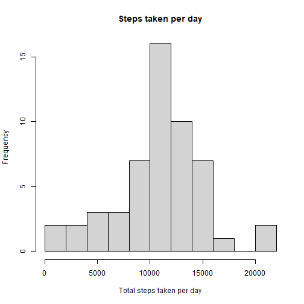
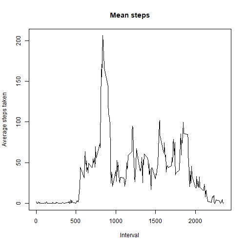
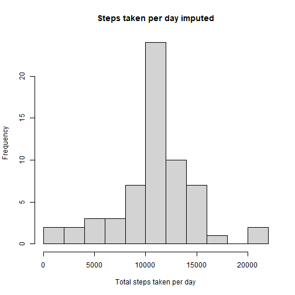
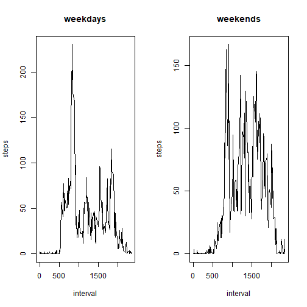

```r
Sys.setlocale("LC_ALL","English")
```

```
## [1] "LC_COLLATE=English_United States.1252;LC_CTYPE=English_United States.1252;LC_MONETARY=English_United States.1252;LC_NUMERIC=C;LC_TIME=English_United States.1252"
```

## Loading and preprocessing the data


```r
data <- read.csv("activity.csv")
```


## What is mean total number of steps taken per day?

```r
library(dplyr)

stepsPerDay <- data %>%
  group_by(date) %>%
  summarise(total = sum(steps))

hist(stepsPerDay$total, main="Steps taken per day", xlab="Total steps taken per day", breaks=15)
```


Mean of the total number of steps taken per day: 

```r
mean(stepsPerDay$total, na.rm=TRUE)
```

```
## [1] 10766.19
```


Median of the total number of steps taken per day: 

```r
median(stepsPerDay$total, na.rm=TRUE)
```

```
## [1] 10765
```


## What is the average daily activity pattern?

```r
meanSteps <- aggregate(steps ~ interval, data, mean)

plot(meanSteps$interval, meanSteps$steps,  type = "l",  main="Mean steps", xlab="Interval", ylab="Average steps taken")
```


5-minute interval containing the maximum number of steps:


```r
meanSteps[which(meanSteps$steps == max(meanSteps$steps)), ]
```

```
##     interval    steps
## 104      835 206.1698
```

## Imputing missing values

Number of missing values:


```r
sum(is.na(data))
```

```
## [1] 2304
```

Impute missing values with the mean of the corresponding interval:


```r
dataImputed <- data

for (i in 1:nrow(dataImputed)) {
  if (is.na(dataImputed[i, 1])) {
    dataImputed[i, 1] <- meanSteps[meanSteps$interval %in% dataImputed[i, 3], 2]
  }
}
```

Check number of NA values:


```r
sum(is.na(dataImputed))
```

```
## [1] 0
```


```r
stepsPerDayImputed <- dataImputed %>%
  group_by(date) %>%
  summarise(total = sum(steps))

hist(stepsPerDayImputed$total, main="Steps taken per day imputed", xlab="Total steps taken per day", breaks=15)
```



Mean of the total number of steps taken per day: 

```r
mean(stepsPerDayImputed$total, na.rm=TRUE)
```

```
## [1] 10766.19
```


Median of the total number of steps taken per day: 

```r
median(stepsPerDayImputed$total, na.rm=TRUE)
```

```
## [1] 10766.19
```


There is a slight difference in the median.


## Are there differences in activity patterns between weekdays and weekends?


```r
# Create gender vector
dataImputed$day <- weekdays(as.Date(dataImputed$date))

for(i in 1:nrow(dataImputed)) {
  if (dataImputed[i, 4] %in% c("Saturday", "Sunday")) {
    dataImputed[i, 4] <- "weekend"
  } else {
    dataImputed[i, 4] <- "weekday"
  }
}

dataImputed$day <- factor(dataImputed$day)

head(dataImputed)
```

```
##       steps       date interval     day
## 1 1.7169811 2012-10-01        0 weekday
## 2 0.3396226 2012-10-01        5 weekday
## 3 0.1320755 2012-10-01       10 weekday
## 4 0.1509434 2012-10-01       15 weekday
## 5 0.0754717 2012-10-01       20 weekday
## 6 2.0943396 2012-10-01       25 weekday
```


```r
weekdaySteps <- dataImputed[dataImputed$day == 'weekday', ]
weekendSteps <- dataImputed[dataImputed$day == 'weekend', ]

weekdayStepsMean <- aggregate(steps ~ interval, weekdaySteps, mean)
weekendStepsMean <- aggregate(steps ~ interval, weekendSteps, mean)

head(weekdayStepsMean)
```

```
##   interval      steps
## 1        0 2.25115304
## 2        5 0.44528302
## 3       10 0.17316562
## 4       15 0.19790356
## 5       20 0.09895178
## 6       25 1.59035639
```

```r
head(weekendStepsMean)
```

```
##   interval       steps
## 1        0 0.214622642
## 2        5 0.042452830
## 3       10 0.016509434
## 4       15 0.018867925
## 5       20 0.009433962
## 6       25 3.511792453
```


```r
par(mfcol=c(1, 2))


plot(weekdayStepsMean$interval, weekdayStepsMean$steps, type="l", xlab="interval", ylab="steps", main="weekdays")

plot(weekendStepsMean$interval, weekendStepsMean$steps, type="l", xlab="interval", ylab="steps", main="weekends")
```


